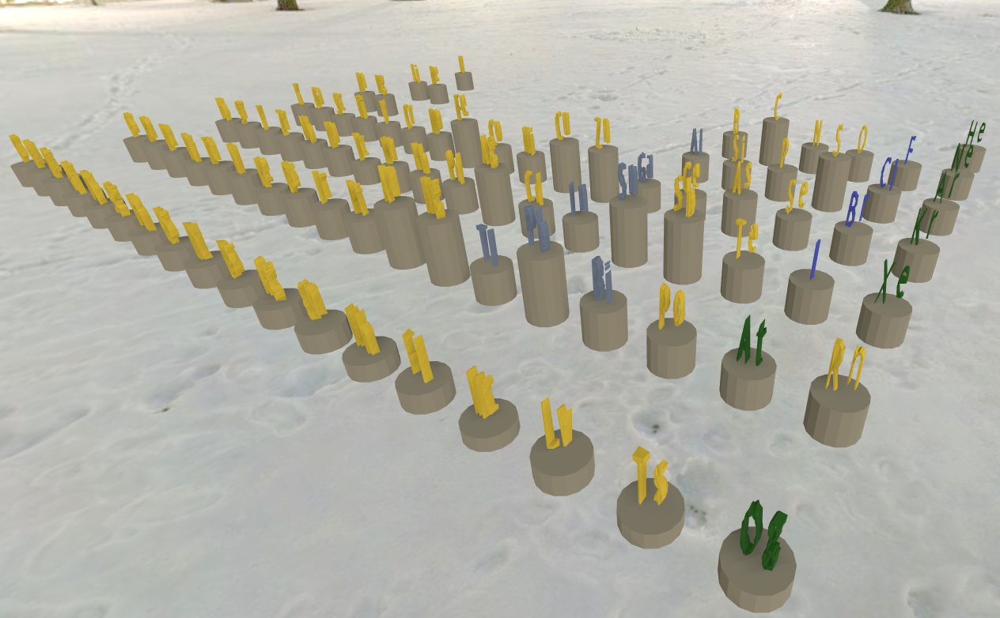
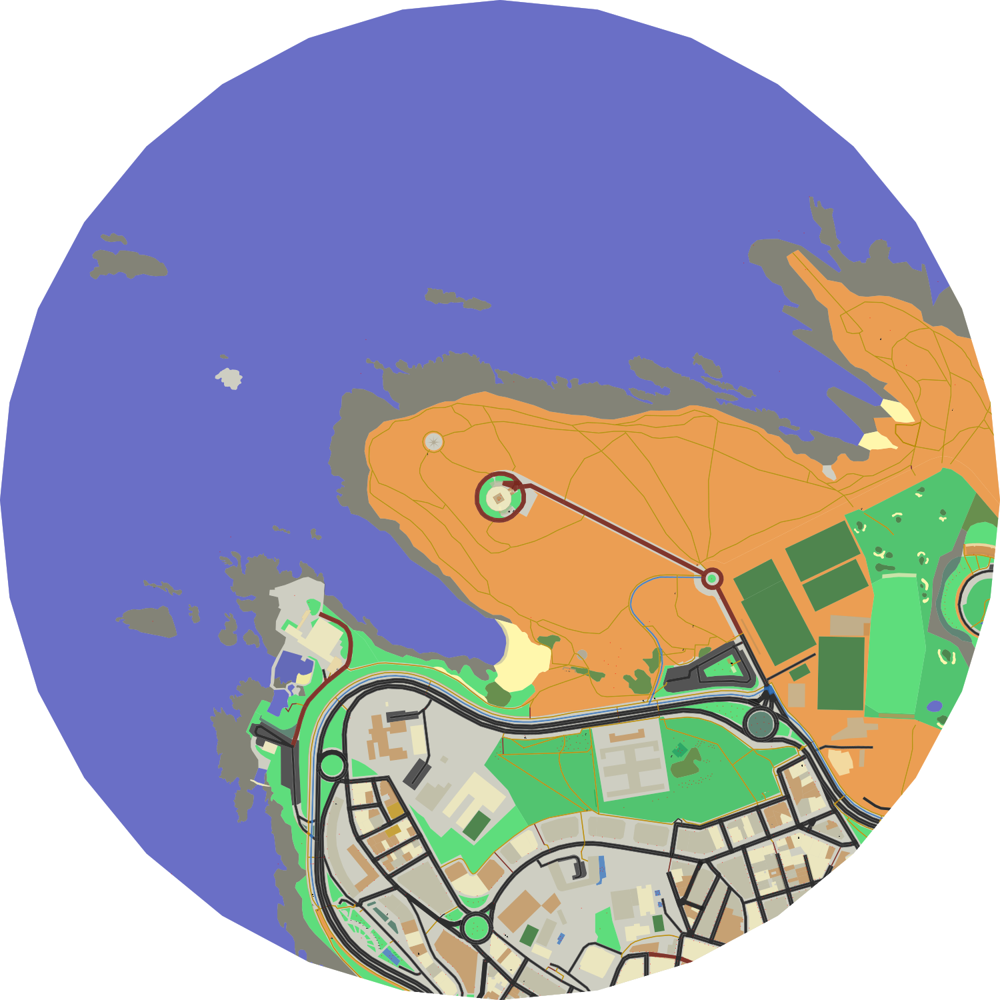

# DDD(123)

DDD(123) is a library for procedural generation of 2D and 3D geometries and scenes.

DDD purpose is to provide a very expressive API for building and operating with
shapes and models and at the same time closely reflect the hierarchy and metadata
that usually needs to accompany your built 2D or 3D documents.

DDD follows an object graph (or in 3D, a scene graph) approach. Documents (scenes)
are composed by nodes that form a **node tree**. A key concept in DDD is that
operations can be applied to individual nodes, entire branches, or selected
nodes within a hierarchy.

DDD can export entire scenes or branches easily to several 2D and 3D
formats: SVG, PNG, GLTF/GLB, custom JSON structure.

DDD includes an 'object catalog' concept, which allows reusing and caching objects
speeding up the generation process, and allowing render engines to leverage shared
meshes and geometry instancing.

The library is strongly based and relies on the underlying Shapely and Trimesh
packages which provide most of the geometry operations.

DDD is accompanied by its sibling projects:

- DDD123 OSM: a build pipeline that generates 2D/3D tiles from OpenStreetMap data (in this repo).

- DDD123 Viewer: HTML5 2D and 3D viewer.

- DDD123 Unity Tools: tools for Unity3D that postprocess DDD exported GLB files
  and handles prefab objects, lights, colliders, and materials from DDD metadata
  (not open source).

## Features

- Procedurally generate, alter and align 2D and 3D geometry.
- Export 2D to SVG and PNG.
- Export 3D to GLTF, FBX or OBJ.
- TTF based generation of text geometry.
- Object catalog ("prefabs") management (object and geometry instancing).
- Handle materials (colors) and normals.
- A small procedural models library (trees, urban props...)
- Document generation transformation pipeline support.
- UV mapping and collider primitives support. Texture atlas support.
- OpenStreetMap data 2D and 3D generation pipelines.

## Introduction

(TODO)

Allow easy programatic definition of 1D, 2D and 3D objects.

Workflow oriented to scenegraph, manipulate entire hierarchies.

Based on Shapely and Trimesh

Example uses: OSM, procedural game scenes (eg. minigolf), polygonal 2D game maps

(Screenshots)

## Installation

(TODO)

**For Osmium package (reading OSM files)**

sudo apt-get install build-essential cmake libboost-dev libexpat1-dev zlib1g-dev libbz2-dev

**For GDAL installation (accessing GIS datasources) - Ubuntu 18.04**

For 18.04, installed gdal==2.2.3 (matches libgdal version, gdal-config --version):
Exported C and CPLUS_LIBRARY_PATH as per https://gis.stackexchange.com/questions/28966/python-gdal-package-missing-header-file-when-installing-via-pip
export CPLUS_INCLUDE_PATH=/usr/include/gdal/
export C_INCLUDE_PATH=/usr/include/gdal/

## Examples

**Quick generate 3D OSM**

ddd osm-build --center=41.224, 1.725 --radius=125

## Documentation

TODO: Introduce doc here and move sections to where appropriate.

###

### Metadata

(?)

_*		Used internally? (not exported?)
    _last_extr?		Extrusion info... etc?

osm:*		OpenStreetMap schema metadata
    osm:item:*	Item
    osm:way:*	Way
    osm:area:*	Area
    + layer + area/way raised vs base + base_height (osm, ddd...)

**

    ddd:map:way:width ??

**Properties understood by... (?)**

ddd:*	DDD metadata
    ddd:crop:*			Cropping
    ddd:elevation:*		Elevation applying
    ddd:align:*			Align type
    ddd:area:raising?	?

### OSM data import (preprocessing)

Note: latest versions are doing extraction automatically from country-latest.pbf.

Using PBFs:
  osmconvert spain-latest.osm.pbf -b=-5.870,40.760,-5.470,41.160 -o=salamanca-latest.osm.pbf
  osmconvert spain-latest.osm.pbf -b=-8.980,41.980,-8.480,42.480 -o=vigo-latest.osm.pbf
  osmconvert spain-latest.osm.pbf -b=-8.600,43.170,-8.200,43.570 -o=acoruna-latest.osm.pbf

Then, geojson (TODO: use osmium directly):
  ./osmtogeojson city-latest.osm.pbf > /tmp/city.geojson

### Converting carto icons to texture atlas

Using:

    for a in $(ls *.svg) ; do inkscape -w 64 -h 64 $a --export-filename ../amenity-$a.png ; done

Resize with margin:

    mogrify -path x -resize 120x120 -gravity Center -extent 128x128 *.png

## Gallery

Videos:

- [OSM 3D generation pipeline (Lighting talk at OSM SOTM 2020)](https://youtu.be/R_AHn_eLpso)
- [Godot integration example](https://youtu.be/wQVSpBloGj0)

")

")

## FAQ

## License

